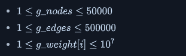
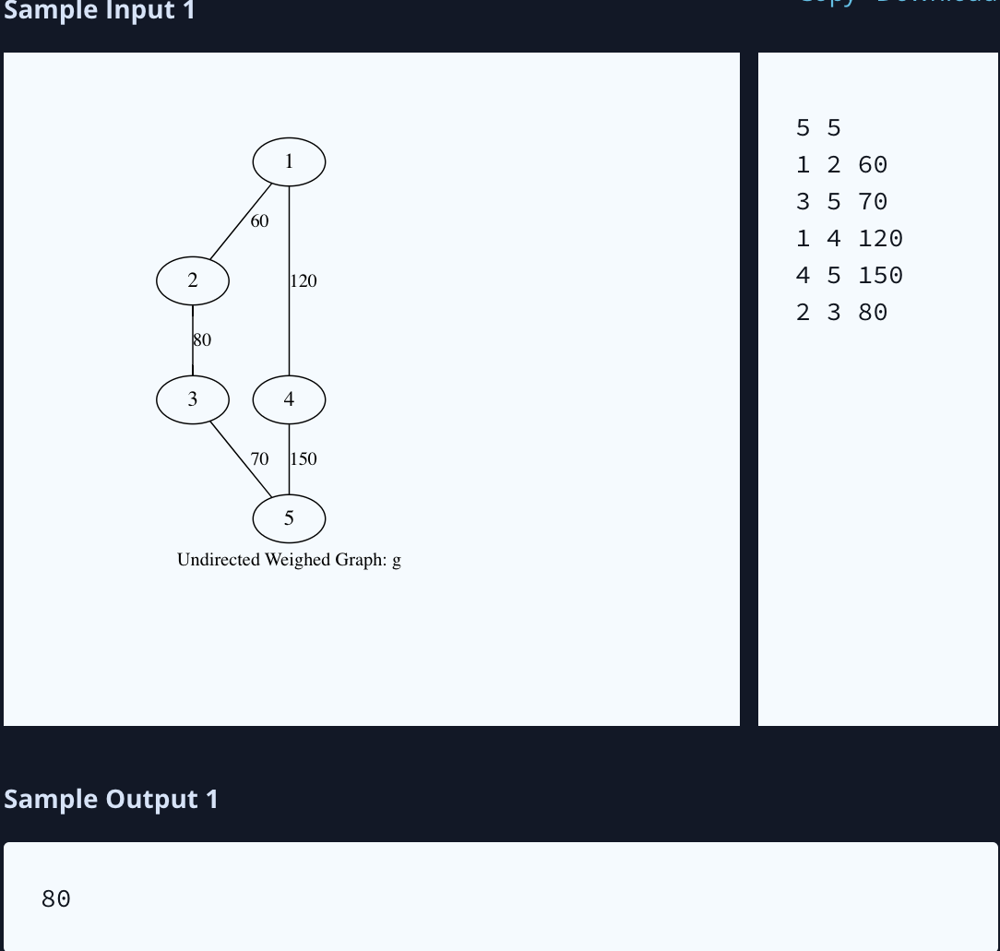
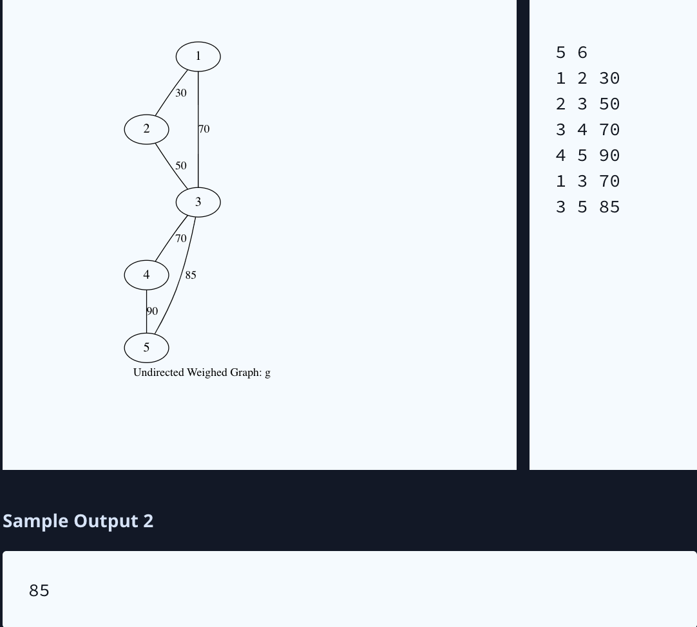

Jack has just moved to a new city called Rapture. He wants to use the public public transport system. The fare rules are as follows:

Each pair of connected stations has a fare assigned to it regardless of direction of travel.
If Jack travels from station A to station B, he only has to pay the difference between (the fare from A to B) and (the cumulative fare paid to reach station A), [fare(A,B) - total fare to reach station A]. If the difference is negative, travel is free of cost from A to B.
Jack is low on cash and needs your help to figure out the most cost efficient way to go from the first station to the last station. Given the number of stations  (numbered from  to ), and the fares (weights) between the  pairs of stations that are connected, determine the lowest fare from station  to station .

Links(The question is lack of some number, see the original post): https://www.hackerrank.com/challenges/jack-goes-to-rapture/problem?isFullScreen=true&h_r=next-challenge&h_v=zen#!

Example

The graph looks like this:

Travel from station  costs  for the first segment () then the cost differential, an additional  for the remainder. The total cost is .

Travel from station  costs  for the first segment, then an additional  for the remainder, a total cost of .

The lower priced option costs .

## Function Description
Complete the getCost function in the editor below.

getCost has the following parameters:

int g_nodes: the number of stations in the network
int g_from[g_edges]: end stations of a bidirectional connection
int g_to[g_edges]:  is connected to  at cost 
int g_weight[g_edges]: the cost of travel between associated stations
Prints
- int or string: the cost of the lowest priced route from station  to station  or NO PATH EXISTS. No return value is expected.

## Input Format

The first line contains two space-separated integers,  and , the number of stations and the number of connections between them.
Each of the next  lines contains three space-separated integers,  and , the connected stations and the fare between them.

## Constraints

Sample Input 1

## Explanation 1

There are two ways to go from first station to last station.

For the first path, Jack first pays  units of fare to go from station  to . Next, Jack has to pay  units to go from  to . Now, to go from  to , Jack has to pay  units, but since this is a negative value, Jack pays  units to go from  to . Thus the total cost of this path is  units.

For the second path, Jack pays  units to reach station  from station . To go from station  to , Jack has to pay  units. Thus the total cost becomes  units. So, the first path is the most cost efficient, with a cost of .

Sample Input 2

## Explanation 2

Travel starts at node  and there are two paths to node  that cost either  or . Taking the route from  through  to  brings the cost up to , while going directly from  to  costs only .